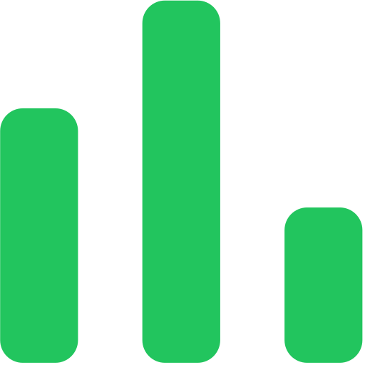
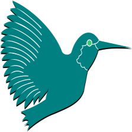
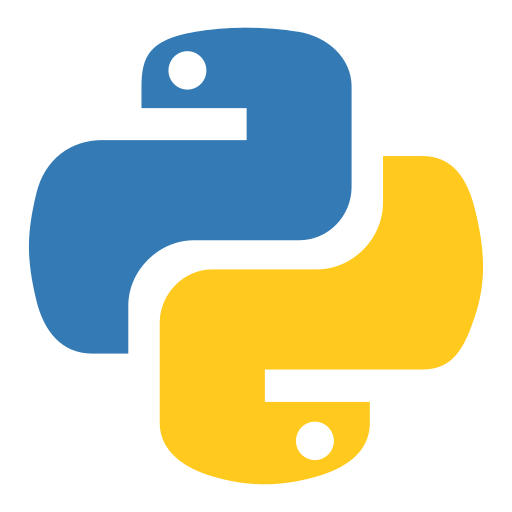

<h1> Hi there, I'm Satyam Singh Niranjan - aka <a href="https://www.youtube.com/watch?v=dQw4w9WgXcQ">Satanarious</h1>

<table>
<tr>
  <td width=65%>
<h3> I'm a Nobody!!</h3>
    <ul>
<li> 🎉 Fun fact about me: I was born in a car
<li> 🎮 I usually play Valorant at night
<li> 🎵 Checkout my playlists by clicking the 'Spotify 🎧' section embeds.
<li> ⭐ Checkout my starred repositories <a href="https://github.com/Satanarious?tab=stars">here</a>.
<li> 🎓 I am looking to collaborate with other developers.
<li> 👩‍💻 I like exploring/discovering FOSS,Tech Communities, Mod Communities.
<li> 🔍 You'll can find me on various services labelled under the 'Find Me Here' section</a>.
      </ul>
    </td>
  <td>
  <h3> Spotify 🎧 </h3>

   </td>
</table>
 
 

  

 

### Work Experience

In the overview below you will find my most recent work experience:

**Python Developer** \
[**Codespeedy Technologies Pvt Ltd.**](https://www.codespeedy.com/) • Internship \
Languages & Technologies: `Python`, `SEO` \
Author Url: [Satyam Singh Niranjan(Author Codespeedy)](https://www.codespeedy.com/author/satyam_singh/) \
 
 

**Junior Software Developer** \
[**FOSSEE, IIT Bombay**](https://fossee.in/) • Fellowship \
Languages/Tools: `Python`, `Qt`, `SQL`, `Git`, `Github`, `LaTeX` \
Software: [Osdag](https://osdag.fossee.in/) \
Featured Projects: [Osdag3](https://github.com/Satanarious/Osdag3), [Osdag](https://github.com/Satanarious/Osdag)
 

### Find Me Here

<table border=2px>
<thead>
  <tr>
    <td></td>
    <td></td>
    <td></td>
    <td></td>
    <td></td>
    <td></td>
    <td></td>
    <td></td>

  </tr>
  <tr>
  <th>Email</th>
  <th>Books</th>
  <th>Youtube</th>
  <th>Spotify</th>
  <th>Reddit</th>
  <th>Pinterest</th>
  <th>Discord</th>
  <th>Steam</th>
  </tr>
</thead>
</table>

<table>
  <tr>
        <td></td>
    <td></td>
    <td></td>
    <td></td>
    </tr>
  <tr>
    <th>Valorant</th>
    <th>Stats.fm</th>
    <th>Stash</th>
    <th>MAL</th>
    </tr>
  </table>

 

### Languages : &nbsp;

<table border=2px>
<thead>
<tr>
    <td></td>
    <td></td>
    <td></td>
    <td></td>
    <td></td>
    <td></td>
    <td></td>
    <td></td>
  </tr>
  <tr>
    <th>C</th>
    <th>C++</th>
    <th>HTML</th>
    <th>CSS</th>
    <th>Dart</th>
    <th>LaTeX</th>
    <th>Python</th>
    <th>SQL</th>
  </tr>
</thead>
<tbody>
  
</tbody>
</table>

### Tools : &nbsp;

<table border=2px>
<thead>
<tr>
    <td></td>
    <td></td>
    <td></td>
    <td></td>
    <td></td>
    <td></td>
    <td></td>
    <td></td>
    <td></td>
  </tr>
  <tr>
    <th>Blender</th>
    <th>Office</th>
    <th>Git</th>
    <th>Qt</th>
    <th>Flutter</th>
    <th>Firebase</th>
    <th>MySQL</th>
    <th>SQLite</th>
    <th>Selenium</th>
  </tr>
</thead>
</table>

---

### :zap: GitHub Stats

&nbsp;&nbsp;&nbsp;&nbsp;&nbsp;&nbsp;&nbsp;&nbsp;

   
  <b>Note:</b> This is only a metric of the languages my public code on GitHub consists of and does not reflect my expertise or skill level.

        

